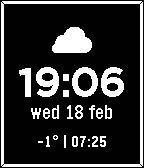

# Minimal weather

Simple pebble watch face with weather data from YR.no. 

It shows a battery warning when below 25%, a UV index warning when index is above 3, and a rain warning when expected precipitation is above 1 mm.
It shows the time for the next sunrise and sunset.

Weather icons: [Weather API Icons](https://www.figma.com/files/team/964437122260547846/resources/community/file/1102960831369614781/weather-api-icons)
Status icons: [Hero icons](https://heroicons.com/)
